# UI Fix Plan & Prioritization — PurchaseAssistant

This document details the prioritization, shared root causes, component architecture recommendations, and step-by-step implementation order for fixing the PurchaseAssistant UI/UX issues.

---

## Issue Classification

### P0 Issues — Workflow-Breaking (Critical Data & Navigation Bugs)

1. **Hardcoded Login Credentials in Production Code:**
   - **Location:** `flutter_app/lib/features/auth/presentation/login_page.dart:37–38`
   - **Problem:** Pre-filled default login email and password ship in production code, risking security leakage and autofill conflicts.
   - **Fix:** Remove hardcoded pre-fill strings; rely strictly on saved biometric state or user input.

2. **Un-disposed Controllers in Task Assignment & Backup Dialogs:**
   - **Location:** `flutter_app/lib/features/staff/presentation/staff_tasks_page.dart:114–187`, `flutter_app/lib/features/settings/presentation/backup_page.dart:363–417`
   - **Problem:** Dialog text controllers created without `dispose()`, leaking memory and listeners on repeated opens.
   - **Fix:** Move dialog form state into stateful dialog widgets with proper `initState` and `dispose` lifecycle.

3. **Orphan `TextEditingController` Fallback in Reorder Levels List:**
   - **Location:** `flutter_app/lib/features/catalog/presentation/catalog_setup_reorder_levels_page.dart:207`
   - **Problem:** `_values[id] ?? TextEditingController()` in list `itemBuilder` creates an orphan controller on every rebuild if `id` is missing from map, causing cursor jumps and leaks.
   - **Fix:** Populate map during initialization or state change before list render; never instantiate fallback controllers inside `itemBuilder`.

4. **Broken Staff Route Navigation Backs:**
   - **Location:** `flutter_app/lib/features/settings/presentation/settings_page.dart:400`, `flutter_app/lib/features/settings/presentation/help_guide_page.dart:19`
   - **Problem:** Back actions hardcode `context.popOrGo('/home')` or `/settings`. When staff users open Settings or Help from `/staff`, tapping back bounces them to the owner `/home` route instead of `/staff/home`.
   - **Fix:** Branch back navigation based on current session role or route path (`loc.startsWith('/staff') ? '/staff/home' : '/home'`).

---

### P1 Issues — Major UX Problems (Responsive, Scroll, & Input Deficiencies)

1. **Compact Sheet Inner Scroll Violation (Double Scroll):**
   - **Location:** `flutter_app/lib/features/stock/presentation/widgets/stock_warehouse_filter_sheet.dart:24–26,122`, `flutter_app/lib/features/contacts/presentation/broker_wizard_page.dart:807`
   - **Problem:** Modal sheets set `compact: true` on `showHexaBottomSheet` while wrapping their body in an outer `SingleChildScrollView` or `KeyboardSafeFormViewport`, causing nested scroll bounces and blank sheet collapse on Flutter web.
   - **Fix:** Enforce single scroll owner per sheet. Use shrink-wrapped `ListView` for short forms (`compact: true`) or explicit sheet height (`compact: false`) for complex forms with inner lists.

2. **Desktop Nested Scroll in Purchase Wizard Review Step:**
   - **Location:** `flutter_app/lib/features/purchase/presentation/wizard/purchase_review_tally_step.dart:192`, `flutter_app/lib/features/purchase/presentation/purchase_entry_wizard.dart:2237`
   - **Problem:** Desktop purchase wizard wraps review step in a `SingleChildScrollView` inside an already scrolling parent scroll view, causing double scrollbars and gesture conflicts.
   - **Fix:** Add `embeddedInOuterScroll: true` support to `PurchaseReviewTallyStep` (matching `PurchaseTermsOnlyStep`) to bypass nested scroll view on desktop.

3. **Purchase History Detail Pane Over-Responsive Layout:**
   - **Location:** `flutter_app/lib/features/purchase/presentation/purchase_detail_page.dart:1413,1478`, `flutter_app/lib/features/purchase/presentation/widgets/purchase_desktop_detail_pane.dart:57`
   - **Problem:** `PurchaseDetailBody` checks `MediaQuery.sizeOf(context).width >= 1024` (full window width) instead of local pane width when embedded in a 50% history split pane, forcing a 2-column layout inside a narrow 500px pane.
   - **Fix:** Respect the `embedded: true` flag in `PurchaseDetailBody` to render a single-column layout when hosted in a master-detail side pane.

4. **Search Rebuild & Scroll Reset on Keystroke:**
   - **Location:** `flutter_app/lib/features/home/presentation/home_breakdown_list_page.dart:164–165,276`
   - **Problem:** `_searchCtrl.addListener(() => setState(() {}))` rebuilds entire page and list tree on every keystroke, resetting list scroll position while typing.
   - **Fix:** Debounce search filter updates (~300ms) and filter data locally without destroying list widget keys.

5. **Search Tab Auto-Focus Behavior:**
   - **Location:** `flutter_app/lib/features/search/presentation/search_page.dart:270–278`
   - **Problem:** Post-frame callback automatically calls `_focus.requestFocus()`, opening soft keyboard immediately on mobile navigation and shrinking the viewport.
   - **Fix:** Only autofocus when explicitly navigated with `autofocus=true` query param; keep search field unfocused by default on tab switch.

---

### P2 Issues — Visual Polish & Component Discipline

1. **Inconsistent Raw `TextField` Usage (Design System Drift):**
   - **Locations:** `catalog_page.dart`, `contacts_page.dart`, `reports_top_bar.dart`
   - **Problem:** Feature screens directly instantiate Material `TextField` instead of using standard `AppTextField`.
   - **Fix:** Standardize feature inputs on `AppTextField` with consistent 16px radius, `HexaColors.gray100` fill, and floating labels.

2. **Missing Mouse Cursor & Hover Affordances on Desktop:**
   - **Locations:** Stock list rows, Catalog cards, Home KPI tiles
   - **Problem:** Interactive rows rely on default system cursor instead of `SystemMouseCursors.click`, making desktop web interactions feel un-native.
   - **Fix:** Wrap interactive cards and table rows in `MouseRegion(cursor: SystemMouseCursors.click)` with hover color highlights.

3. **Inconsistent Error Message Presentation:**
   - **Location:** `catalog_item_create_page.dart:804–808`
   - **Problem:** Save errors rendered as raw red `Text` widgets instead of using inline `errorText` on `AppTextField` or `FriendlyLoadError`.
   - **Fix:** Pass validation errors directly to `AppTextField(errorText: ...)` for consistent visual feedback.

---

## Shared Root Causes & Component Architecture

1. **Double IME Inset Application:** Scaffold `resizeToAvoidBottomInset: true` plus manual `MediaQuery.viewInsetsOf(context).bottom` padding on inner form viewports causes keyboard double-lift and content top clipping.
   - *Architecture Fix:* `KeyboardSafeFormViewport` default `useViewInsetBottom: false` when hosted under Scaffold. Scaffold handles keyboard lift once.
2. **Inconsistent Sheet Height Modes:** Mixing `compact: true` with outer `SingleChildScrollView` or `compact: false` without explicit height causes blank sheet collapse on Flutter web.
   - *Architecture Fix:* Standardize on `showHexaBottomSheet`: `compact: true` for short forms with shrink-wrapped `ListView`, `compact: false` with explicit height for complex list sheets.
3. **Controller Lifecycle Leaks in Anonymous Dialogs:** Creating controllers inline inside `showDialog` builder methods leads to orphan controllers.
   - *Architecture Fix:* Extract dialog bodies to dedicated `StatefulWidget` classes that manage and dispose their own `TextEditingController` and `FocusNode` instances in `dispose()`.

---

## Implementation Order & Phasing

```mermaid
flowchart TD
    Phase1[Phase 1: Shared Core Controls] --> Phase2[Phase 2: P0 Critical Workflow Fixes]
    Phase2 --> Phase3[Phase 3: P1 Responsive & Scroll Fixes]
    Phase3 --> Phase4[Phase 4: P2 Visual Polish & Hover States]
    Phase4 --> Phase5[Phase 5: Integration & Regression Testing]

    subgraph Phase1 [Phase 1: Shared Core Controls]
        P1_1["AppTextField Standardization"]
        P1_2["KeyboardSafeFormViewport Single-Owner IME"]
        P1_3["showHexaBottomSheet Contract Enforcement"]
    end

    subgraph Phase2 [Phase 2: P0 Critical Workflow Fixes]
        P2_1["Remove Hardcoded Login Credentials"]
        P2_2["Fix Un-disposed Dialog Controllers"]
        P2_3["Fix Orphan Reorder Level Controller Fallback"]
        P2_4["Fix Staff Back Navigation Routing"]
    end

    subgraph Phase3 [Phase 3: P1 Responsive & Scroll Fixes]
        P3_1["Fix Compact Sheet Double Scroll"]
        P3_2["Fix Purchase Wizard Desktop Review Scroll"]
        P3_3["Fix Purchase Detail Embedded Master-Detail Layout"]
        P3_4["Fix Search Keystroke Rebuild & Focus Behavior"]
    end

    subgraph Phase4 [Phase 4: P2 Visual Polish & Hover States]
        P4_1["Add Desktop MouseRegion & Click Cursors"]
        P4_2["Standardize Form Validation Error Styling"]
        P4_3["Unify Card & Button Design Tokens"]
    end

    subgraph Phase5 [Phase 5: Integration & Regression Testing]
        P5_1["Write Viewport & Focus Widget Tests"]
        P5_2["Write Autocomplete Single-Select Tests"]
        P5_3["Full Responsive QA Audit"]
    end
```

---

## Required Regression Tests

1. **Login Focus Viewport Test:**
   - Pump `LoginPage` at phone (390x844) and desktop (1536x864). Focus password field with simulated IME `viewInsets`.
   - Assert header title remains in viewport (`headerTopDy >= 0`).

2. **Supplier Autocomplete Single-Select Test:**
   - Pump `PurchaseEntryWizard` party step. Type "Suraj".
   - Tap suggestion row once. Assert selected supplier == "Suraj Rice Traders", overlay closes, and overlay does not reopen on field unfocus.

3. **Form Window Resize Focus Test:**
   - Pump `CatalogItemCreatePage`. Focus item name field and type "Basmati Rice".
   - Re-pump with resized viewport (1536x864 -> 800x600).
   - Assert typed text remains "Basmati Rice", focus node retains focus, and cursor position is preserved.

4. **Reorder Levels List Rebuild Test:**
   - Pump `CatalogSetupReorderLevelsPage`. Scroll list and type new reorder value in row 5.
   - Trigger provider update / rebuild. Assert text controller is preserved from map and no memory leak occurs.

---

## Files To Be Modified During Implementation

### Core & Shared
- `flutter_app/lib/core/design_system/widgets/app_text_field.dart`
- `flutter_app/lib/core/design_system/widgets/app_button.dart`
- `flutter_app/lib/core/design_system/hexa_responsive.dart`
- `flutter_app/lib/shared/widgets/keyboard_safe_form_viewport.dart`

### Auth & Settings
- `flutter_app/lib/features/auth/presentation/login_page.dart`
- `flutter_app/lib/features/settings/presentation/settings_page.dart`
- `flutter_app/lib/features/settings/presentation/help_guide_page.dart`
- `flutter_app/lib/features/settings/presentation/backup_page.dart`

### Purchase & Stock
- `flutter_app/lib/features/purchase/presentation/purchase_entry_wizard.dart`
- `flutter_app/lib/features/purchase/presentation/wizard/purchase_review_tally_step.dart`
- `flutter_app/lib/features/purchase/presentation/purchase_detail_page.dart`
- `flutter_app/lib/features/purchase/presentation/widgets/purchase_desktop_detail_pane.dart`
- `flutter_app/lib/features/stock/presentation/widgets/stock_warehouse_filter_sheet.dart`
- `flutter_app/lib/features/stock/presentation/widgets/opening_stock_filter_sheet.dart`

### Catalog, Contacts, Search & Staff
- `flutter_app/lib/features/catalog/presentation/catalog_setup_reorder_levels_page.dart`
- `flutter_app/lib/features/catalog/presentation/catalog_item_create_page.dart`
- `flutter_app/lib/features/contacts/presentation/broker_wizard_page.dart`
- `flutter_app/lib/features/contacts/presentation/supplier_create_wizard_page.dart`
- `flutter_app/lib/features/search/presentation/search_page.dart`
- `flutter_app/lib/features/staff/presentation/staff_tasks_page.dart`
- `flutter_app/lib/features/staff/presentation/staff_item_gallery_page.dart`

---

## Implementation status (2026-08-20)

Verified in source (not claimed “works” until tests below):

- **P0:** Login fields empty; staff task dialog is a StatefulWidget that disposes controllers; backup dry-run disposes controller; reorder list uses `catalogReorderControllerFor`; staff Settings/Help back routes branch on `/staff`.
- **P1:** Warehouse filter compact sheet is a shrink `Column`; broker wizard step 0 no nested SCSV; desktop purchase review `embeddedInOuterScroll`; purchase detail two-column only when not `embedded`; opening-stock supplier controller owned; home breakdown search debounced 300ms; search tab no longer autofocuses on every load.
- **P2:** Primary/secondary buttons + breakdown tiles use click cursor; catalog/contacts/reports search use `AppTextField`; create-item errors use theme error color.
- **Shared:** `AppSearchField`, `AppSelectField`, `AppTooltip`, `showHexaConfirmDialog`, `AppClickTarget`, `MobileDetailScaffold`; IME still owned by Scaffold + `KeyboardSafeFormViewport` default `useViewInsetBottom: false`.
- **Foundation (2026-08-20 slice):** barrel re-exports empty/error/skeleton; confirm dialog uses `AppSecondaryButton` / `AppPrimaryButton`; autocomplete overlay rows use click cursor.
- **Login:** Sign In uses `AppLoadingButton`; email/password controllers remain empty (no prefill). `VERIFIED_TEST` login keyboard viewport.
- **Purchase Batch 1:** bag-weight compact sheet is shrink `Column` (host owns scroll); `kgCtrl` disposed in `finally` (`VERIFIED_CODE`). Desktop review already `embeddedInOuterScroll`.

